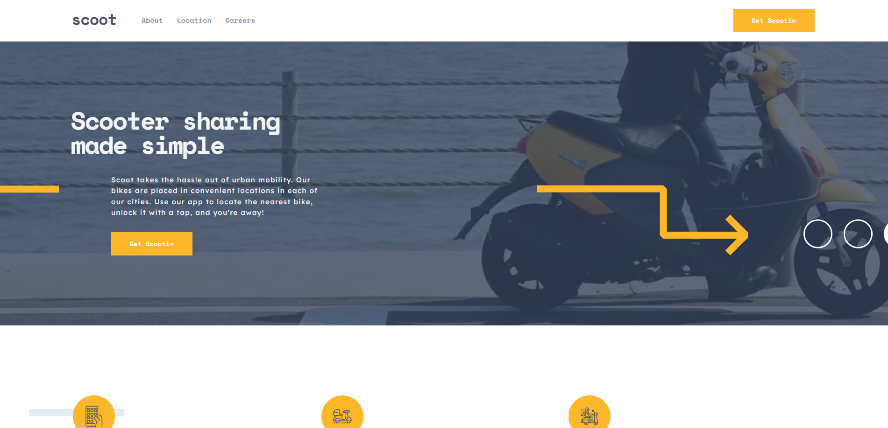

# Frontend Mentor - Scoot website solution

This is a solution to the [Scoot website challenge on Frontend Mentor](https://www.frontendmentor.io/challenges/scoot-multipage-website-N76alNPRJ). Frontend Mentor challenges help you improve your coding skills by building realistic projects. 

## Table of contents

- [Overview](#overview)
  - [The challenge](#the-challenge)
  - [Screenshot](#screenshot)
  - [Links](#links)
- [My process](#my-process)
  - [Built with](#built-with)
- [Author](#author)

## Overview

### The challenge

Users should be able to:

- View the optimal layout for each page depending on their device's screen size
- See hover states for all interactive elements throughout the site

### Screenshot

- Main: 
- Main-tablet: [./screenshots/Main-tablet.png](./screenshots/Main-tablet.png)
- About-tablet: [./screenshots/About%20page_faq+cta+footer-tablet.png](./screenshots/About%20page_faq+cta+footer-tablet.png)
- Careers-tablet: [./screenshots/Careers%20page_jobs-tablet.png](./screenshots/Careers%20page_jobs-tablet.png)

### Links

- Solution URL: [https://github.com/Jo-cloud85/scoot-multi-page-website.git](https://github.com/Jo-cloud85/scoot-multi-page-website.git)
- Live Site URL: [https://Jo-cloud85.github.io/scoot-multi-page-website](https://Jo-cloud85.github.io/scoot-multi-page-website)

## My process

### Built with

- Semantic HTML5 markup
- CSS custom properties
- Flexbox
- CSS Grid
- Mobile-first workflow

## Author

- Frontend Mentor - [@Jo-cloud85](https://www.frontendmentor.io/profile/Jo-cloud85)
